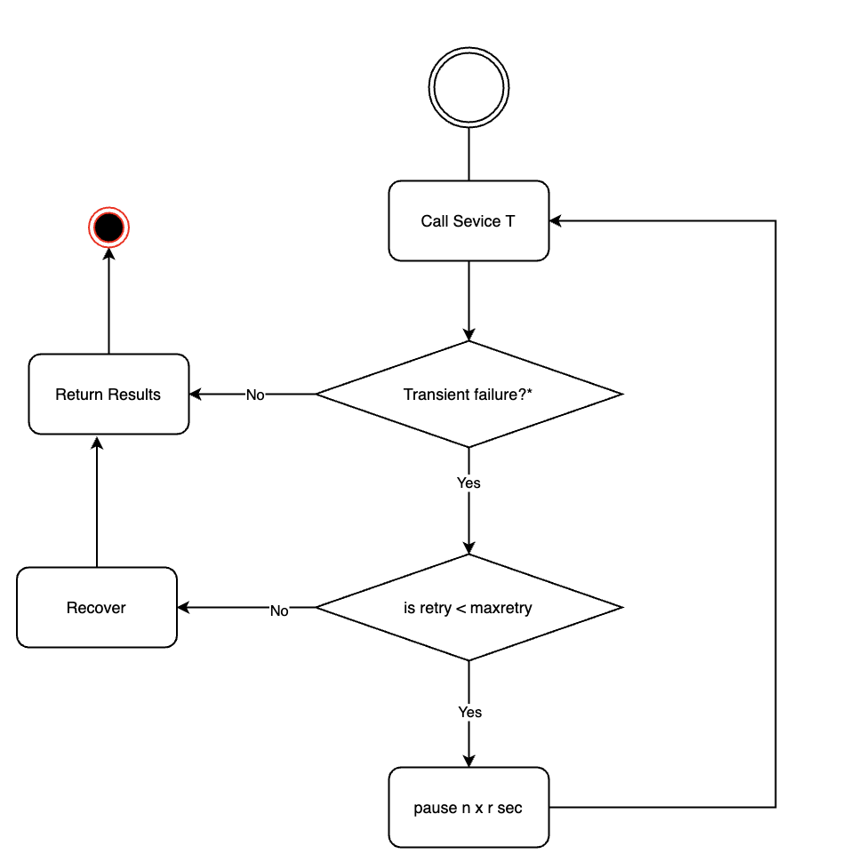

+++
fragment = "content"
weight = 100

title = "Gracefull exit"
background = "light"
[sidebar]
  sticky = true
+++

Here are some pointers to consider whenever an external service is invoked.
<!--more-->


### Problem

As we design more and more microservices, The application logic is moved to smaller services and the communication happens through network than function/method calls. It is true that network is getting super fast and more reliable than it was 5 years ago. The beauty of the microservice architecture is that providing higher degree of control to teams developing the service and lower degree of control over dependencies. This asks for designing resilient systems which can tolerate failures; building observability into development. I will walk you through a very simple but useful way to connect to external service and gracefully degrade on failures.

### Back-off strategies

Generally, failures are caused by live changes to the services. It could be new integrations, new capabilities, configuration changes etc. Sometimes, networks, server overloads, servers not being ready cause failures which are ephemeral in nature and the calls will be successful when you retry. It is essential to design how your service is going to handle retries and recoveries so transient failures can be handled gracefully. Here are some of the most used retry strategies

- Simple Retry - Retry immediately on failure
- Fixed Backoff - Retry after t minutes on failure
- Exponential and Incremental Backoff - Retry after t * n minutes where n is proportional to the number of attempts
- Backoff with Jitters - Random jitters applied to exponential Backoff to avoid collision between many client who use the same algorithms.

Along with retries, It is better to design what is the recovery method that gets called when your service returns failure eventually after maxing out the retries. These fallbacks can be meaningful error message or a back-up/cache data etc ..

### Plain NodeJS example for incremental Backoff

```
 const backoff = async(attempt, delay, fn, exponent=1) => {
   try {
     return await fn;
   }catch(error) {
     if(attempt > 0) {
       await sleep(delay * exponent);
       await backoff(--attempt, delay, fn, ++exponent);
     } else {
       return error;
     }
   }
 }

 const sleep = async(duration) => {
   return new Promise(resolve => {
     setTimeout(() => {
       resolve();
     }, duration)
   }
   )
 }
```

### Conclusion

 While Backoffs and jitters can help with client and server to fail safe, distribute load and avoid longer latency, Sometimes transient failures are not just momentary. When many clients retry on a long-lasting failure, both client and servers are overloaded resulting in resource exhaustion. [Circuit breakers](https://martinfowler.com/bliki/CircuitBreaker.html) come into rescue in those scenario. There are many other architecture patterns which can help developers design systems which are tested for failures. It is critical to know, understand and implement when they are required.

### Further Reading

[Exponential Backoff & Jitter](https://aws.amazon.com/blogs/architecture/exponential-backoff-and-jitter/)
[Building a Circuit Breaker in Node.js](https://blog.bearer.sh/build-a-circuit-breaker-in-node-js/)